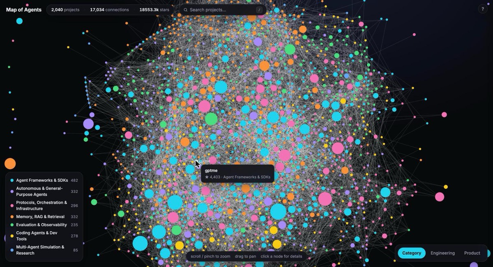
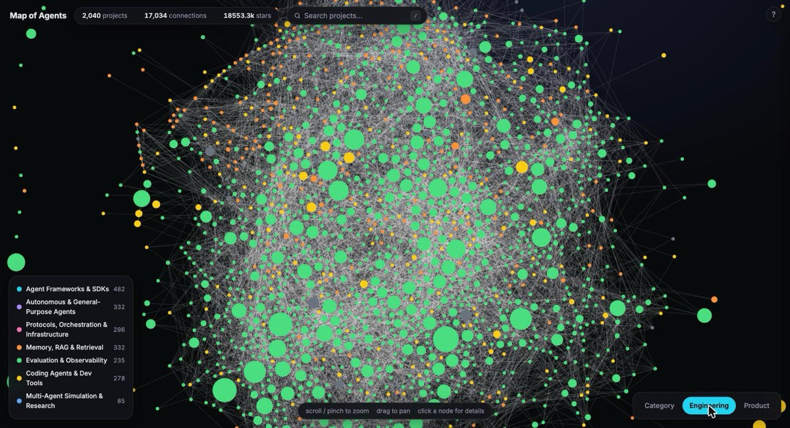
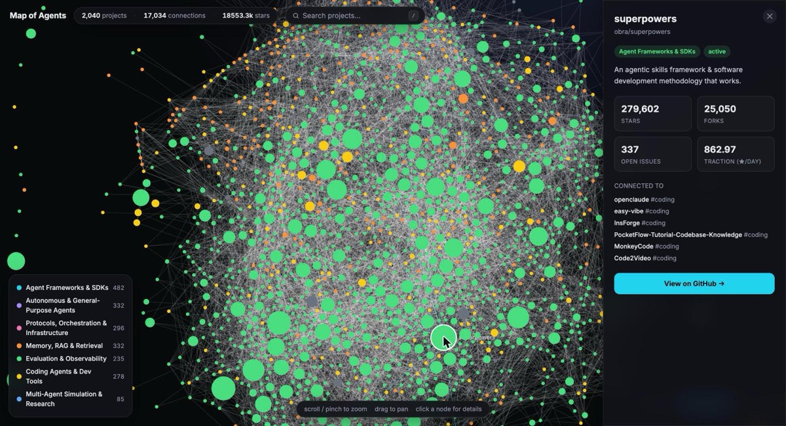

# Map of Agents — Graph

A **force-directed map of the AI agent ecosystem** — 2,040 real projects pulled live
from the GitHub API, connected by 17,000+ edges built from the relationships that actually
exist between them: shared topic tags and shared owning orgs. Where [Map of Agents](https://github.com/shaileshjaiswalwins/map-of-agents)
groups projects into a treemap by category, this one shows the *network* — which projects
cluster together, which ecosystems (LangChain, MCP, AutoGPT-likes) are hubs, and which
projects are outliers with few connections.

Inspired by [anvaka/map-of-reddit](https://github.com/anvaka/map-of-reddit)
([live demo](https://anvaka.github.io/map-of-reddit/)), which maps subreddits as a
force-directed graph where proximity comes from shared user activity. Here, proximity comes
from shared GitHub topics and shared organizations — a genuine structural signal, not a
layout trick.

**[Live demo →](https://shaileshjaiswalwins.github.io/map-of-agents-graph/)**

## Screenshots

### Category lens — the ecosystem's actual shape
Each dot is a project; lines are shared topics or shared owning orgs. Dense clusters are
crowded sub-spaces; the loose strands reaching outward are the outliers.


### Engineering lens — maintenance health
Green = active, amber = moderate, orange = stale, grey = archived/unknown. Spot risk in the
crowd before you depend on something.


### Click any project — connections and why


## What it's for

- **See the ecosystem's real shape**, not a flat list. Dense clusters mean a crowded
  sub-space (e.g. everything built around MCP); sparse, loosely-connected nodes are the
  outliers worth a second look.
- **Two analytical lenses**, same as Map of Agents: **Engineering** (color by maintenance —
  active/moderate/stale/archived) to spot risk before you depend on something, and
  **Product** (color by traction — stars/day since creation) to spot momentum independent
  of raw star count.
- **Click any project** for its strongest connections and *why* they're connected (a shared
  topic tag or a shared owning org) — a fast way to discover adjacent tools you didn't know
  to search for.

## How it works

- **Data**: `scripts/fetch_live_data.py` pulls live metrics for hundreds of projects via the
  GitHub REST API — broad topic search (`GET /search/repositories`) across 7 categories,
  merged with a curated flagship list, deduped by `full_name`.
- **Graph construction**: `scripts/build_graph_data.py` builds edges from two real signals —
  shared GitHub topics (excluding generic tags like `python` or `llm` that would connect
  everything) and shared owning org/user. Edge weight favors shared-owner over shared-topic;
  each node keeps only its strongest ~12 edges so a handful of huge hub topics don't collapse
  the whole graph into one blob.
- **Layout**: a live [d3-force](https://d3js.org/d3-force) simulation (charge + link + collide)
  runs client-side and settles in the browser — no precomputed coordinates, so the layout is
  always a genuine physical relaxation of the current data.
- **Rendering**: HTML5 Canvas (not SVG) so hundreds of nodes and their edges redraw at 60fps
  while panning/zooming — the same approach map-of-reddit and map-of-github use at much larger
  scale.
- **Interaction**: scroll/pinch to zoom (labels fade in as you get close), drag to pan, click
  a node for a detail panel with its top connections, click a legend category to isolate it,
  `/` to search then `Enter` to jump to a match (or fit all matches in view), `Esc` to close/clear.
- **Shareable links**: opening any project updates the URL (`?node=owner/repo`) via
  `history.replaceState` — copy the address bar or hit "Copy link" in the detail panel to send
  someone straight to that project, pre-selected and pre-zoomed, tour skipped.
- **Onboarding**: a short 4-step tour on first visit, replayable via the `?` button.
- **No build step** — a static `docs/index.html` + `docs/data.json`, styled with Tailwind
  (CDN) and rendered with D3, hosted directly from GitHub Pages.

## A note on data honesty

Star counts come straight from the GitHub API with no fraud-filtering — like Map of GitHub,
this reflects GitHub as it actually reports itself, including any repos with anomalously
fast star growth (a known, unsolved problem across the ecosystem, not something this project
can reliably detect). Node size is stars but under a square-root scale specifically so one
outlier can't visually dominate a category; if a bubble looks implausibly large for how known
the project is, that's a signal to check it, not an editorial claim about its quality.

## Running locally

```bash
cd docs
python3 -m http.server 8080
# open http://localhost:8080
```

## Refreshing the data

Requires the [GitHub CLI](https://cli.github.com/) authenticated (`gh auth login`).

```bash
python3 scripts/fetch_live_data.py     # pulls live metrics into docs/raw_live_data.json (gitignored)
python3 scripts/build_graph_data.py    # builds nodes + edges into docs/data.json
```

`fetch_live_data.py` takes several minutes — GitHub's search endpoint is rate-limited to 30
requests/minute. Edit the `CATEGORIES` dict to add flagship repos or broaden topic-search
queries per category.

## Project structure

```
map-of-agents-graph/
├── docs/
│   ├── index.html            # the visualization (canvas force graph, two lenses)
│   └── data.json             # generated dataset (nodes + weighted edges, live metrics)
├── scripts/
│   ├── fetch_live_data.py    # pulls live GitHub metrics (search + per-repo lookups)
│   └── build_graph_data.py   # builds the node-link graph, computes derived signals
└── assets/                   # README screenshots
```

## Credits

- Concept and force-directed approach inspired by [anvaka/map-of-reddit](https://github.com/anvaka/map-of-reddit).
- Companion project: [Map of Agents](https://github.com/shaileshjaiswalwins/map-of-agents) (treemap view).
- Built with [D3.js](https://d3js.org/) and the [GitHub REST API](https://docs.github.com/en/rest).
